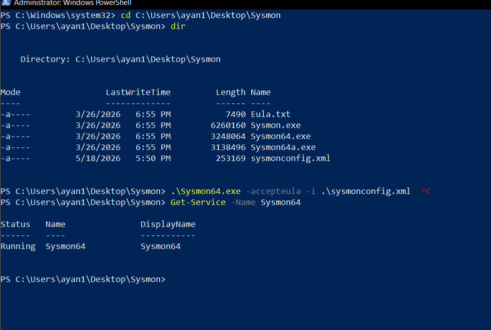
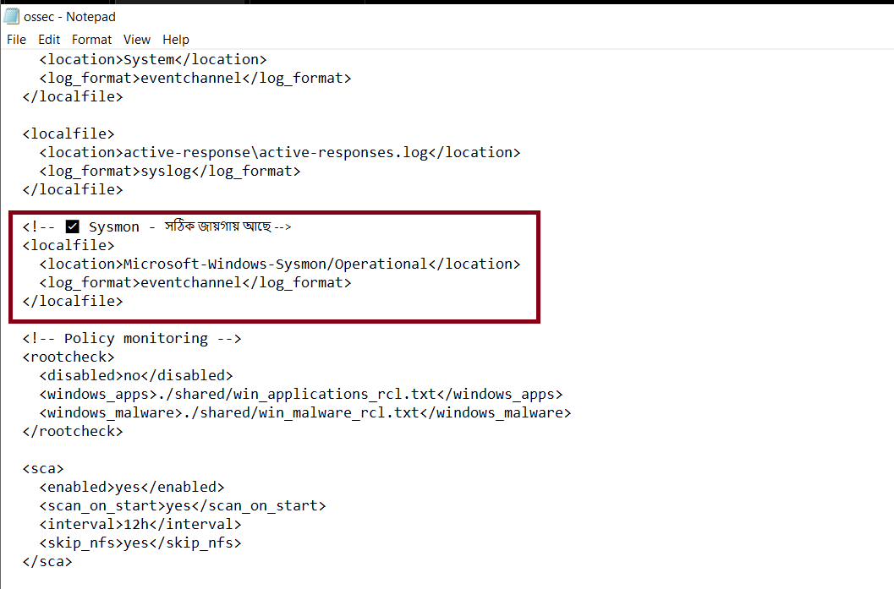
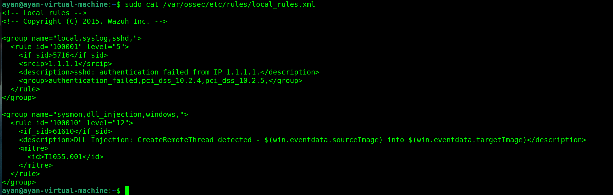
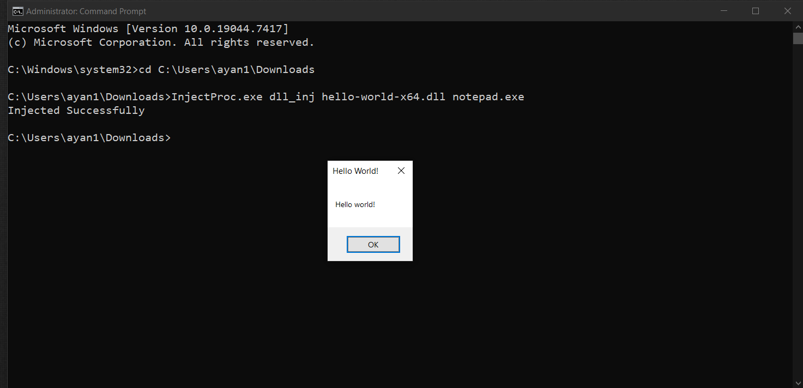
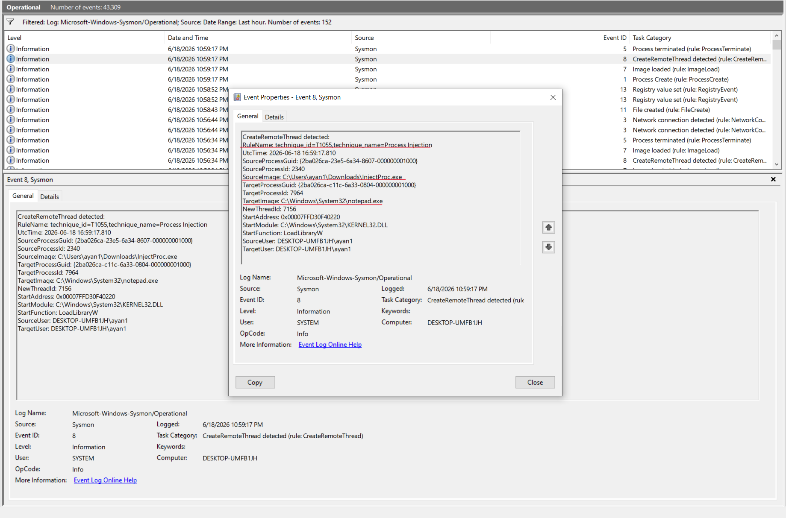
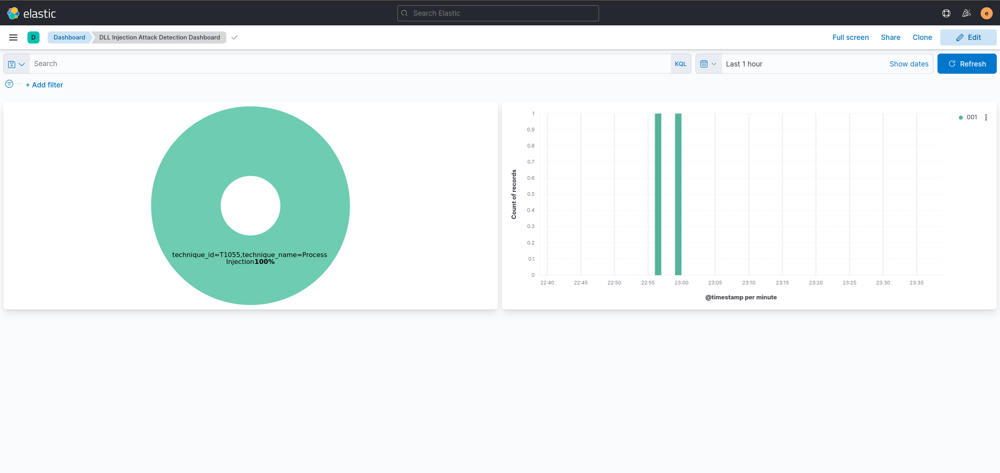
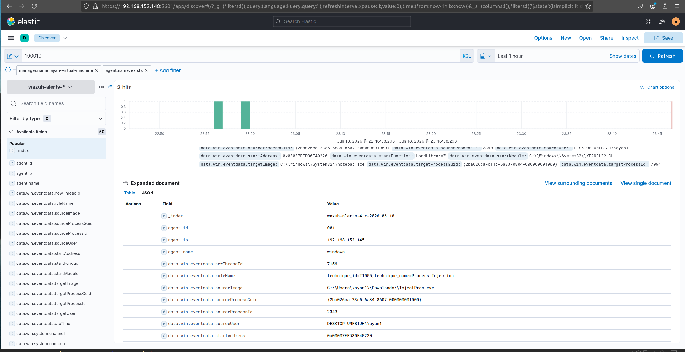

# DLL Injection Attack Detection Using Wazuh SIEM

## Project Overview

This project demonstrates how to detect **DLL Injection attacks** using **Wazuh SIEM** combined with **Sysmon** on a Windows endpoint. DLL Injection is a technique where malicious code is injected into a running process by loading a Dynamic Link Library (DLL) into that process's memory space.

**MITRE ATT&CK Technique:** [T1055.001 - Dynamic-link Library Injection](https://attack.mitre.org/techniques/T1055/001/)

---

## Lab Environment

| Component | Details |
|-----------|---------|
| SIEM | Wazuh v4.5.4 |
| OS (Manager) | Ubuntu Linux (VM) |
| OS (Agent) | Windows 10 IoT Enterprise LTSC 2021 |
| EDR Tool | Sysmon v15 (with sysmon-modular config) |
| Attack Tool | InjectProc v0.1 |
| Dashboard | Elastic + Kibana (port 5601) |

---

## Architecture

```
Windows Agent (192.168.152.145)
        |
        | Sysmon monitors processes
        | Wazuh Agent collects logs
        |
        v
Wazuh Manager (192.168.152.148)
        |
        | Analyzes events
        | Fires custom rule 100010
        |
        v
Filebeat → Elasticsearch → Kibana Dashboard
```

---

## Step 1: Sysmon Installation and Configuration

Sysmon (System Monitor) is a Windows system service that monitors and logs system activity to the Windows Event Log.

### Install Sysmon with custom config:

```powershell
cd C:\Users\ayan1\Desktop\Sysmon
.\Sysmon64.exe -accepteula -i .\sysmonconfig.xml
```

### Verify Sysmon is running:

```powershell
Get-Service -Name Sysmon64
```

**Expected output:**
```
Status   Name        DisplayName
------   ----        -----------
Running  Sysmon64    Sysmon64
```

### Screenshot: Sysmon Service Running


The sysmon config used is based on [sysmon-modular](https://github.com/olafhartong/sysmon-modular) which includes detection rules for:
- **Event ID 1:** Process Creation
- **Event ID 7:** Image Loaded (DLL Load)
- **Event ID 8:** CreateRemoteThread (DLL Injection indicator)

---

## Step 2: Wazuh Agent Configuration

The Wazuh Agent on Windows must be configured to collect Sysmon logs from the Windows Event Channel.

### File: `C:\Program Files (x86)\ossec-agent\ossec.conf`

Add the following block to enable Sysmon log collection:

```xml
<!-- Sysmon Log Collection -->
<localfile>
    <location>Microsoft-Windows-Sysmon/Operational</location>
    <log_format>eventchannel</log_format>
</localfile>
```

### Fix Sysmon Log Permission (Required):

```powershell
$acl = "O:BAG:SYD:(A;;0x3;;;SY)(A;;0x3;;;BA)(A;;0x2;;;LS)(A;;0x2;;;NS)(A;;0x2;;;AU)"
wevtutil sl "Microsoft-Windows-Sysmon/Operational" /ca:$acl
Restart-Service WazuhSvc
```

### Screenshot: ossec.conf Configuration


---

## Step 3: Wazuh Custom Detection Rule

Wazuh's built-in rule for Sysmon Event ID 8 (rule ID: 61610) has `level="0"` which means no alert is generated by default. We create a custom rule to override this.

### File: `/var/ossec/etc/rules/local_rules.xml` (on Wazuh Manager)

```xml
<!-- DLL Injection Detection Rules using Sysmon -->
<group name="sysmon,dll_injection,windows,">
  <rule id="100010" level="12">
    <if_sid>61610</if_sid>
    <description>DLL Injection: CreateRemoteThread detected - $(win.eventdata.sourceImage) into $(win.eventdata.targetImage)</description>
    <mitre>
      <id>T1055.001</id>
    </mitre>
  </rule>
</group>
```

### Rule Chain Explanation:

```
60000  → Windows base rule (decoded_as: windows_eventchannel)
  60004  → Sysmon channel rule (win.system.channel)
    61600  → Sysmon INFORMATION event
      61610  → Event ID 8: CreateRemoteThread (level=0, no alert)
        100010 → OUR CUSTOM RULE (level=12, HIGH ALERT!) 
```

### Apply the rule:

```bash
sudo systemctl restart wazuh-manager
```

### Screenshot: Custom Rule Configuration


---

## Step 4: Attack Simulation

### What is DLL Injection?

DLL Injection is when an attacker forces a legitimate process (like `notepad.exe`) to load a malicious DLL. The injected DLL runs inside the trusted process, bypassing security controls.

### Attack Tool: InjectProc

**InjectProc** is an open-source process injection testing tool.

### Running the Attack:

```cmd
cd C:\Users\ayan1\Downloads
InjectProc.exe dll_inj hello-world-x64.dll notepad.exe
```

**Expected output:**
```
Injected Successfully
```

A "Hello World!" popup appears inside notepad.exe — proving the DLL was successfully injected.

### Screenshot: Attack Simulation


---

## Step 5: Detection in Windows Event Viewer

After the attack, Sysmon generates **Event ID 8 (CreateRemoteThread)** in the Windows Event Log.

### Key Event Details:
- **Event ID:** 8
- **Source:** Microsoft-Windows-Sysmon/Operational
- **RuleName:** technique_id=T1055, technique_name=Process Injection
- **SourceImage:** `C:\Users\ayan1\Downloads\InjectProc.exe`
- **TargetImage:** `C:\Windows\System32\notepad.exe`
- **StartFunction:** LoadLibraryW

### Screenshot: Windows Event Viewer - Event ID 8


---

## Step 6: Wazuh Dashboard Alert

After the attack, Wazuh generates a **Level 12 (High Severity)** alert.

### Alert Details in Kibana Discover (filter: `rule.id: 100010`):

| Field | Value |
|-------|-------|
| rule.id | 100010 |
| rule.level | 12 |
| agent.name | windows |
| data.win.eventdata.sourceImage | C:\\Users\\ayan1\\Downloads\\InjectProc.exe |
| data.win.eventdata.targetImage | C:\\Windows\\System32\\notepad.exe |
| data.win.eventdata.startFunction | LoadLibraryW |
| data.win.eventdata.ruleName | technique_id=T1055, technique_name=Process Injection |

### Screenshot: Wazuh Dashboard Alerts


### Screenshot: Alert Details


---

## Detection Flow Summary

```
Attack Happens
    ↓
InjectProc.exe injects hello-world-x64.dll into notepad.exe
    ↓
Sysmon detects CreateRemoteThread (Event ID 8)
    ↓
Wazuh Agent reads Sysmon log (ossec.conf localfile)
    ↓
Wazuh Manager matches rule 100010 (level 12 alert)
    ↓
Filebeat sends to Elasticsearch
    ↓
Kibana Dashboard shows DLL Injection Alert 
```

---

## Key Findings

| Item | Details |
|------|---------|
| Attack Technique | DLL Injection via CreateRemoteThread |
| MITRE ID | T1055.001 |
| Detection Tool | Sysmon Event ID 8 |
| Wazuh Rule | 100010 (Level 12 - High) |
| Source Process | InjectProc.exe |
| Target Process | notepad.exe |
| Injected DLL | hello-world-x64.dll |
| Start Function | LoadLibraryW (KERNEL32.DLL) |

---

## References

- [Wazuh Documentation](https://documentation.wazuh.com)
- [Sysmon - Microsoft Sysinternals](https://docs.microsoft.com/en-us/sysinternals/downloads/sysmon)
- [sysmon-modular by Olaf Hartong](https://github.com/olafhartong/sysmon-modular)
- [MITRE ATT&CK T1055.001](https://attack.mitre.org/techniques/T1055/001/)
- [InjectProc Tool](https://github.com/secrary/InjectProc)

---

## Author

**TahmidZamir**  
GitHub: [@TahmidZamir](https://github.com/TahmidZamir)
